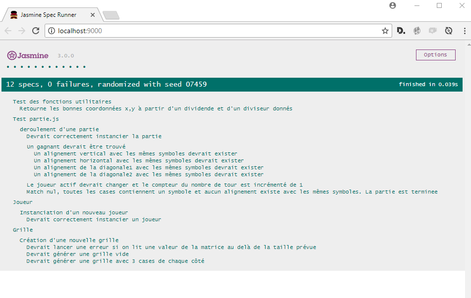

# Tic-tac-toe

> Le jeu du morpion en javascript

## Instructions

[lire l'énoncé en anglais](tic-tac-toe_javascript_test.pdf)

## Version de production

Les livrables se trouvent dans le repertoire `/dist` du projet.
Il suffit de lancer le fichier `index.html` dans un navigateur pour tester l'application.

## Lancer les tests

L'application a été développée à partir de `Yeoman` et le générateur `Webapp`.

Pour lancer les tests unitaires vous devez installer: 
- `npm` le gestionnaire de paquets officiel de `Node.js`
- `Bower`un autre gestionnaire de paquets dédié aux projets front-end
- `Gulp` l'outil qui va permettre de tester l'application

Ouvrez un terminal et lancer la commande:
`npm install --global yo gulp-cli bower generator-webapp`
 
Faites pointer votre terminal dans le repertoire racine du projet et lancer les commandes:
`npm install`
`bower install`

Si tout est bien installé, vous devriez pouvoir lancer les tests unitaires en lançant la commande:
`gulp serve:test`

Votre navigateur devrait s'ouvrir et vous afficher l'écran suivant:

 